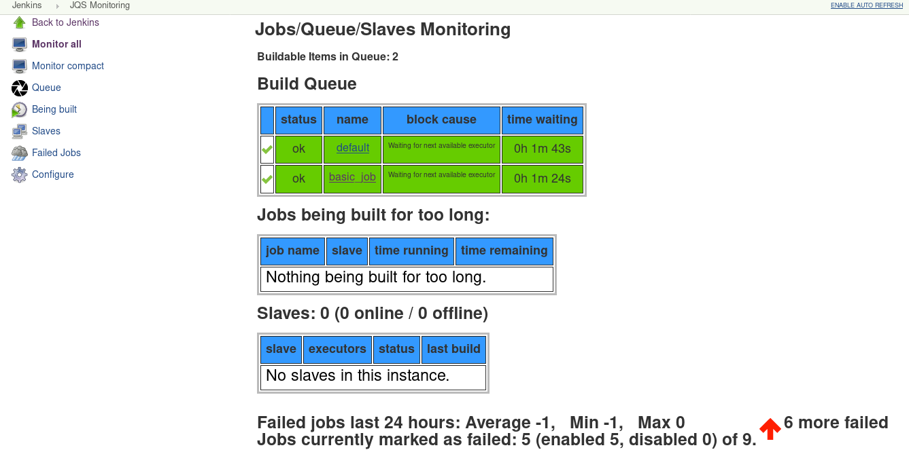
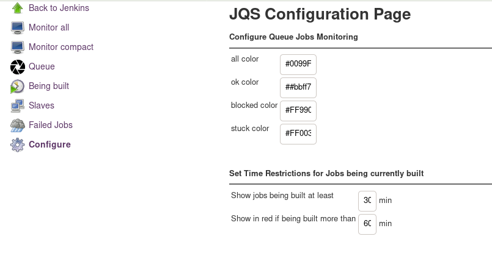

This plugin show information about jobs, slaves and the queue in Jenkins.

The JQS-Monitoring Plugin makes it possible to **monitor what is happening in the job queue**, what is the status of each slave or each job that is being build at the moment. You can also get information about the number of failed builds for the last 24 hours in a histogram graphic. With the plugin you can easily detect if a job is stuck in the queue or being built for too long. The information for the different components can be viewed separately in single pages or simultaneously in one big page. The links to this pages can be found in the left menu-panel of the plugin.

This menu-panel also contains a link to the configuration page, where a number of options can be configured to change the way information is shown(size, color, hide/show options).

#Usage#

The plugin can be used to show information on small or big monitors, the different components can be added to other pages using the links.

For example you can use iframes to continuously monitor several Jenkins instances.

**The plugin will appear in the left-side panel of the jenkins homepage.** Its icon and links are available only for users with administrator permission.

jqs-monitoring-plugin
=====================

Monitoring Plug-in for Jenkins.
